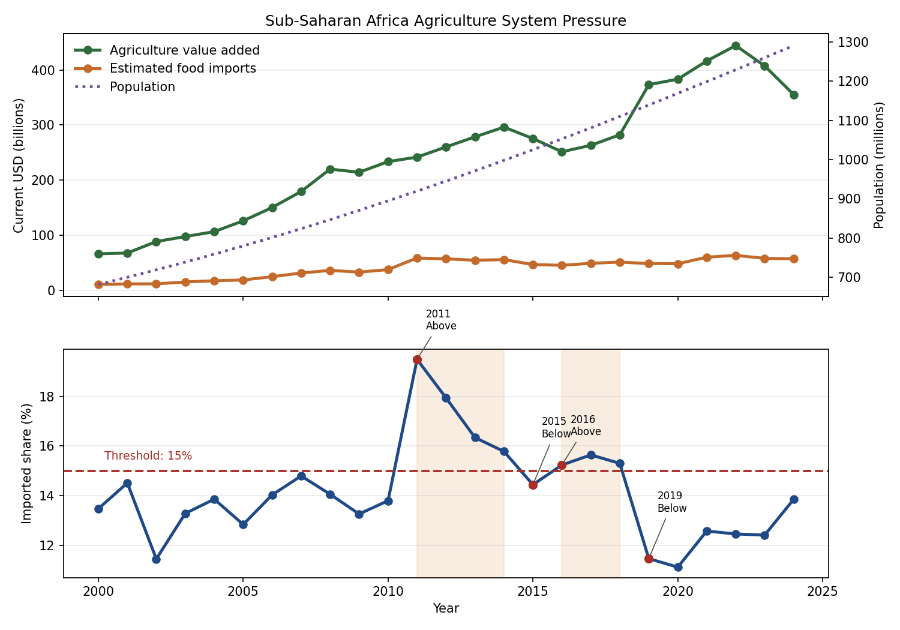

# Agriculture System Pressure in Sub-Saharan Africa

## Region of Study

This example is about Sub-Saharan Africa, not the entire African continent. The local dataset uses the World Bank regional aggregate for Sub-Saharan Africa.

## What the Series Mean

- Agriculture value added: a rough measure of how much economic output the region's farming, forestry, and fishing sectors generated after subtracting intermediate inputs. In simple terms, it is a broad proxy for the value created by domestic agricultural production.
- Estimated food imports: an estimate of how much food the region imported in dollar terms. It is calculated by taking total merchandise imports and applying the World Bank's reported food-import share.
- Population: the total number of people living in Sub-Saharan Africa. It is included as context so the chart can show how the production-import balance changed while the region's population kept growing.
- Imported food share of available supply proxy: a simple threshold signal calculated as food imports divided by agriculture value added plus food imports. It is not a full consumption measure, but it is a transparent proxy for how large imported food appears relative to domestic agricultural output.

## What Is Happening

In this regional view of Sub-Saharan Africa, agriculture value added and estimated food imports both rose over the long run, but imported food became a noticeably larger share of the available-supply proxy during parts of the 2010s.

Using a transparent 15% threshold, the imported-food-share proxy crossed above the line in 2011, moved back below in 2015, crossed above again in 2016, and fell below again in 2019. That means the region spent multiple multi-year stretches above the chosen attention level rather than only a single brief spike.

## Why It Matters

This matters because the raw import and production lines alone do not make the pressure point obvious. The threshold view turns the comparison into a clearer signal: when imports account for a larger share of the system, the balance between domestic production and external supply looks different than it does in lower-share years.

The population context sharpens that reading. Sub-Saharan Africa's population grew substantially across the same period, and the updated chart places population on a second axis so the relationship between people, domestic agricultural output, and food imports can be studied together without implying causation.

## Key Observations

- Agriculture value added rose from about $66.1B in 2000 to about $355.3B in 2024
- Estimated food imports rose from about $10.3B in 2000 to about $57.1B in 2024
- The imported-food-share proxy peaked near 19.5% in 2011
- The proxy spent seven total years at or above the 15% threshold, in 2011-2014 and 2016-2018
- Population increased from about 681M to about 1.29B across the sample

## What to Notice

- The threshold crossing is a more useful signal than either line alone
- Above-threshold periods lasted long enough to look structural within this sample, not purely momentary
- The regional system moved back below the threshold after 2018, but the proxy remained elevated enough to watch

## Takeaway

The descriptive signal here is not that imports replaced domestic production, but that imported food became a meaningfully larger share of the Sub-Saharan African food system during parts of the 2010s and later eased below that threshold. For a non-specialist, the clearest takeaway is that threshold detection helps distinguish normal variation from periods that deserve closer attention.

## Source

The local CSV is built from World Bank regional indicators for Sub-Saharan Africa:

- `NV.AGR.TOTL.CD`
- `TM.VAL.MRCH.CD.WT`
- `TM.VAL.FOOD.ZS.UN`
- `SP.POP.TOTL`

Estimated food imports are calculated as merchandise imports multiplied by the food-import share, and the threshold metric is a simple imported-share-of-available-supply proxy.