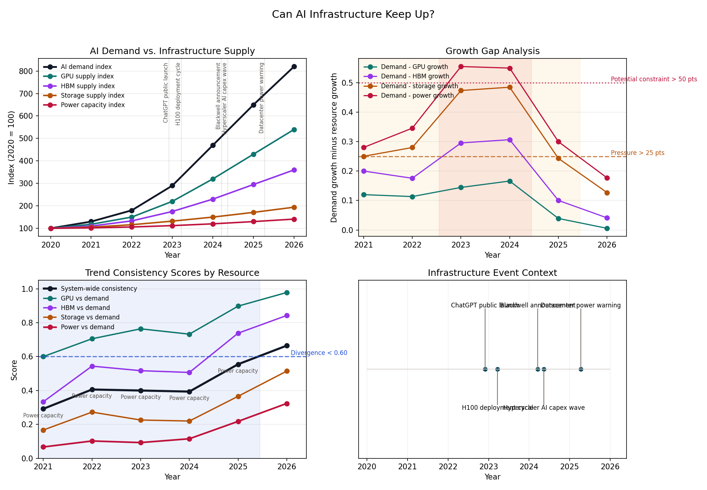

# Can AI Infrastructure Keep Up?

## Question

Can AI infrastructure keep up with growing AI demand?

## What the Signals Mean

This example compares one demand signal with four infrastructure supply signals:

- AI demand index
- GPU supply index
- high-bandwidth memory supply index
- datacenter storage supply index
- datacenter power capacity index

All of the series are indexed to a common baseline so they can be compared transparently even though the underlying real-world units differ.

## What Is Happening

The broad directional story is simple: every signal in the chart rises.

That matters, but it is not the most useful thing to notice. The more important signal is that AI demand rises faster than several key infrastructure inputs for a sustained period. Compute supply grows quickly, but memory and especially power do not keep up at the same pace. Storage grows steadily, but more like supporting capacity than a leading edge of the system.

## Trend Direction Comparison

At the long-run directional level, AI demand and aggregate infrastructure supply move in the same direction. Both rise materially over the period.

That means a simple direction-only comparison would classify the relationship as agreement rather than conflict. But direction alone hides the infrastructure story. The constraint is not that supply is falling. The constraint is that supply grows more slowly than demand in the categories that matter most.

## Trend Consistency Analysis

This example adds a higher-level check: are multiple related signals growing in a way that looks internally consistent?

The consistency score stays relatively healthy in the early years, then weakens when demand growth accelerates faster than memory and power growth. In those years, the strongest constraint is typically power, with memory also lagging enough to matter.

That is the practical value of consistency analysis. It helps distinguish between a system where everything is growing together and a system where the same headline direction masks emerging bottlenecks.

## Thresholds and Context Windows

Three thresholds structure the interpretation:

- a resource pressure window begins when demand growth exceeds a resource growth rate by more than 25 percentage points
- a potential constraint begins when that gap exceeds 50 percentage points
- a system divergence window begins when the consistency score falls below `0.60`

In this example, pressure windows appear when memory, storage, and power growth lag demand meaningfully. The most severe bottleneck periods are driven by power, with memory close behind. Those windows identify the period where the infrastructure story becomes more constrained than the top-line AI growth narrative suggests.

## Events Added for Context

The event overlay includes a small set of public AI infrastructure milestones:

- ChatGPT public launch
- H100 ramp and deployment cycle
- Blackwell announcement
- hyperscaler AI capital spending wave
- public datacenter power-demand warnings

These events do not prove causation. They provide context for why demand acceleration, hardware cycles, and power concerns cluster in the same period.

## Why It Matters

This matters because AI is not only a software story. It is also a systems story about compute, memory, storage, networking, electricity, and capital investment.

If demand rises faster than those supporting layers, then the limiting factor may not be model quality alone. It may be whether the physical system underneath AI can expand quickly enough to keep up.

## What This Does Not Prove

This example does not forecast a specific infrastructure shortfall or claim precise vendor capacity numbers.

The indexed values are transparent analytical proxies informed by public sources and public narratives. They are used to compare rates of change, not to estimate exact global capacity.

## Takeaway

AI demand, compute, memory, storage, and power are all growing rapidly, but not necessarily at the same rate.

The strongest descriptive signal is not that infrastructure is absent. It is that power and memory appear more likely to emerge as binding constraints than raw compute alone when the system is viewed through growth gaps and multi-signal consistency.

## Sources and Limitations

- `ai_infrastructure_signals.csv` is an indexed synthesis informed by public source categories including the Stanford AI Index, NVIDIA datacenter disclosures, HBM supplier commentary, storage-market reporting, and datacenter power analysis from public energy institutions.
- `ai_infrastructure_events.csv` contains public milestone events used only for contextual overlays.
- The comparison is descriptive and explanation-first. It should be read as a structured way to compare signals, not as an infrastructure forecast.