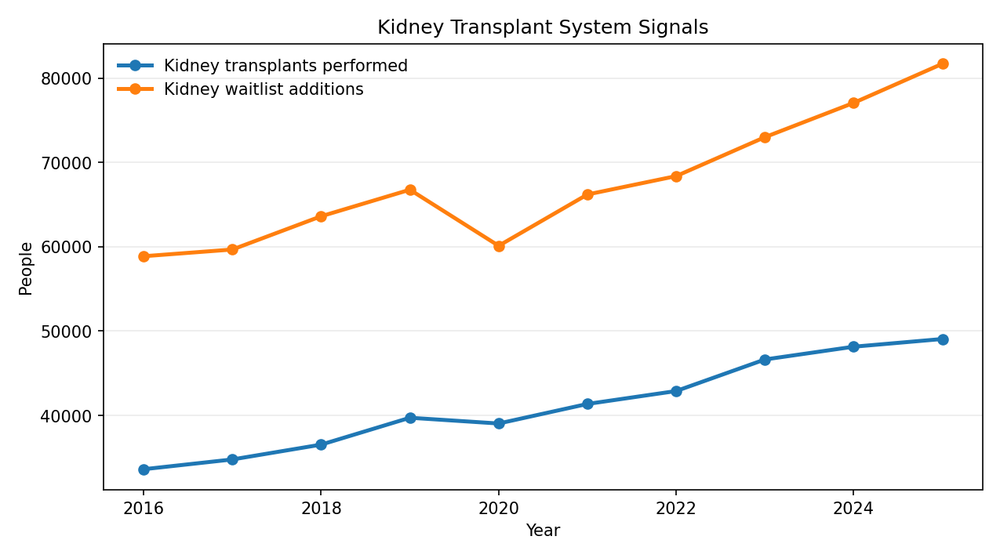

# Kidney Transplant Signal Comparison

## What Is Happening

Kidney transplants and kidney waitlist additions both moved higher over the 2016 to 2025 period. In that sense, the two signals mostly moved together rather than offsetting one another.

The important detail is that the demand-side signal stayed larger than the transplant-volume signal throughout the period. Even as transplant counts climbed, annual waitlist additions also rose and remained well above the number of transplants performed.

## Why It Matters

This matters because a growing transplant count can sound like an unqualified improvement if viewed alone. It becomes more informative when it is compared with a demand signal from the same system.

Looking at the two lines together suggests that system capacity improved, but pressure on the kidney transplant system remained high. The gap did not disappear, even in years when transplant activity grew quickly.

## Key Observations

- Kidney transplants increased from 33,610 in 2016 to 49,065 in 2025
- Kidney waitlist additions increased from 58,888 in 2016 to 81,728 in 2025
- The transplant-to-demand ratio improved slightly, but incoming demand still exceeded transplant volume
- In this annual view, there is no strong simple lag signal that explains the relationship better than shared long-run growth

## What to Notice

- The system expanded, but the pressure also expanded
- A higher transplant count does not automatically mean the underlying demand problem is easing
- The practical signal is persistent strain, not a clean resolution

## Takeaway

The comparison suggests that kidney transplant activity increased meaningfully, but demand pressure also stayed high. For a non-specialist, the clearest takeaway is that progress in transplant volume did not remove the broader system imbalance.

## Source

Transplant and waitlist-addition counts in this example were taken from the public OPTN Metrics dashboard and HRSA's OPTN data pages:

- OPTN Metrics dashboard: https://insights.unos.org/OPTN-metrics/
- HRSA OPTN Data & Calculators: https://www.hrsa.gov/optn/data

Questions like this are often answered best not by a single data point, but by putting data in context and making comparison possible.