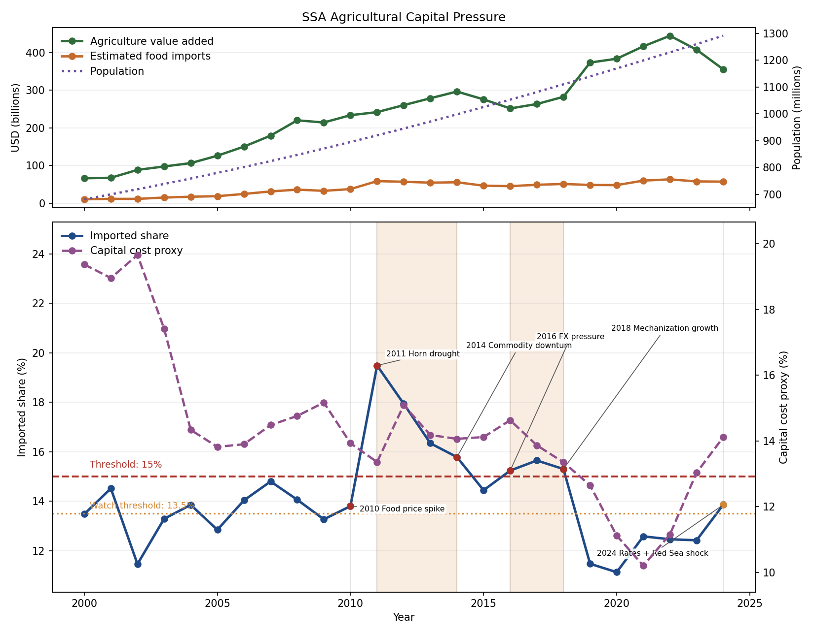

# Agriculture System Pressure, Events, and Capital Context in Sub-Saharan Africa

## Region of Study

This example focuses on Sub-Saharan Africa using World Bank regional aggregates.

## Context from Previous Analysis

This example extends the repository's progression from simple comparison, to threshold detection, to contextual interpretation.

Earlier agriculture analysis identified multi-year periods where the imported-food-share proxy crossed a 15% attention threshold. That previous step helped answer when system pressure became meaningful.

This version keeps the same threshold logic, turns the above-threshold runs into named pressure windows, and asks the next question: what else was happening during those periods, and why might that matter beyond agriculture alone?

## What Was Added

This version introduces two new elements on top of the threshold view:

- contextual event overlays to show what kinds of shocks, stressors, and responses surrounded the pressure windows
- a capital-cost proxy to test whether food-system pressure may align with broader financing strain

The goal is still descriptive. The chart is meant to connect system behavior to real-world context without claiming that any single event caused a threshold crossing.

## Pressure Windows

The main pressure windows are unchanged from the earlier threshold example:

- 2011-2014
- 2016-2018

These were not isolated spikes. They were sustained periods where reliance on imported food became structurally more significant within the available-supply proxy.

The updated chart also keeps population on the first panel as a second-axis context line, and pairs the imported-share series with the capital-cost proxy on the second panel so the timing can be read together.

## Why Events Help

The event list is intentionally small. It is curated to highlight a few moments that help explain the backdrop around the pressure windows:

- the 2010-2011 global food price spike
- the 2011 Horn of Africa drought
- the 2014-2015 commodity downturn
- the 2016 foreign-exchange pressure period in several SSA economies
- the growing policy attention to mechanization and digital agriculture by 2018

When those events are layered onto the pressure windows, a useful pattern appears. External shocks cluster around the start of pressure episodes, macroeconomic stress remains visible during sustained periods, and intervention-oriented signals appear closer to transition points.

That does not prove a causal chain. It does make the threshold windows easier to interpret as real system periods rather than abstract excursions on a line chart.

## Capital Context

The capital-cost line adds another descriptive layer. In this example it is a transparent proxy built from lending-rate series for Nigeria, South Africa, and Kenya rather than a claimed regional borrowing measure.

That proxy shows that capital costs were elevated entering the first pressure window and remained high through much of the 2010s, even though the second threshold window happened after the proxy had eased from its earlier peak.

That matters because it suggests the pressure signal was not just an agriculture-production story. As import dependence rises, the strain can propagate into foreign exchange conditions, external balances, debt pressure, and the wider cost of capital. In that sense, agricultural imbalance can become a broader capital-allocation problem, not just a food-system problem.

## Recent Watch Signal

There is not yet a third pressure window at the main 15% threshold. But the recent rebound is large enough to justify a watch-period narrative. Imported-food share rose from roughly 12.5% in 2022 to 13.9% in 2024, while the capital-cost proxy rose from about 11.2% to 14.1% over the same span.

That is not enough to call 2024 a new pressure window under the main rule. It does support using a lower 13.5% watch threshold to mark renewed monitoring conditions. The added 2024 event in the curated file, higher-for-longer financing conditions combined with Red Sea trade disruption, gives one plausible backdrop for that renewed watch year.

## What To Notice

- thresholds identify when pressure becomes sustained enough to treat as a meaningful period
- events provide context for what may have been happening around those periods
- capital signals show how pressure may propagate beyond the food system itself
- population growth helps explain why baseline demand pressure kept rising across the whole sample
- the timing relationships are useful for interpretation, not proof of causation

Together, those layers turn a simple threshold view into a more system-level interpretation.

## What This Does Not Prove

This analysis does not establish causation between events, imported-food pressure, and capital costs.

It is a structured way to:

- identify pressure periods
- add contextual evidence
- generate better follow-on questions about system stress

## Takeaway

The main analytical step forward is not just that imports increased. It is that sustained periods of import dependence can coincide with broader economic pressure, and that understanding those periods requires combining threshold signals, contextual events, and a second domain trend.

That keeps the strongest elements of the earlier example while extending the repository's capability in a clear direction: from comparison, to thresholds, to context-aware interpretation without causal overclaiming.