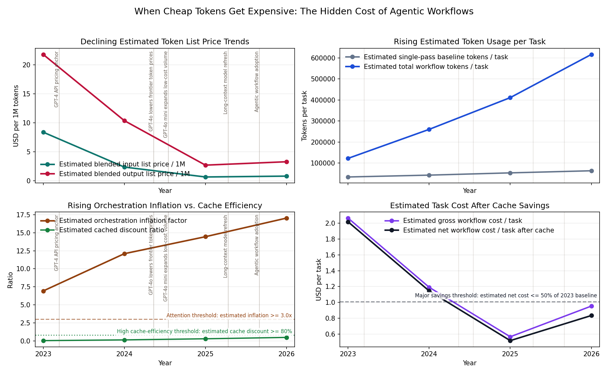

# When Cheap Tokens Get Expensive: The Hidden Cost of Agentic Workflows

## Question

Are falling token prices actually making AI work cheaper per task, or are agents and orchestration loops consuming enough extra tokens to absorb part of the savings?

## What the Signals Mean

This example compares two signals that matter together rather than separately:

- blended token list price per million tokens, using public pricing anchors
- weighted tokens consumed per task, using transparent task and orchestration assumptions

If token prices fall while tokens per task rise, the market is getting cheaper at the unit level but not necessarily at the workflow level.

## Trend Direction Comparison

The core comparison is directional.

If both signals fall, the system is getting cheaper and lighter.
If both rise, more capable workflows are also getting more expensive.
If prices fall while usage rises, the signals conflict and the outcome depends on which force dominates the final cost per task.

In this scenario, token prices fall while task-level token usage rises. That is a conflict signal rather than a clean agreement.

## Thresholds and Context Windows

Three thresholds help translate the chart into something easier to notice:

- estimated orchestration inflation factor at or above 3.0
- estimated cached discount ratio at or above 0.80
- estimated net cost per task decline at or above 50% versus the first year

In the chart, only the panels that use explicit decision thresholds show horizontal threshold lines.

- The price panel has no threshold line. It is a directional context panel showing that estimated blended list prices are declining.
- The usage panel has no threshold line. It is a directional context panel showing that estimated workflow token usage per task is rising.
- The orchestration panel has two threshold lines. The 3.0 line marks when estimated total workflow tokens are at least triple a simpler baseline task profile, and the 0.80 line marks when estimated cache reuse is high enough to apply an 80% discount-equivalent ratio to repeated cacheable input.
- The cost panel has one threshold line. It marks the point where estimated net workflow cost per task is at least 50% below the 2023 baseline level.

The most useful threshold is orchestration inflation. Once workflows repeatedly cross that line, they are no longer just a slightly richer prompt pattern. They behave more like a multi-step execution system with structurally higher token demand.

The cache threshold matters because repeated context only becomes meaningfully cheaper when reuse is high enough to offset the repeated-call overhead.

The cost-decline threshold shows whether lower list prices still win in spite of heavier workflows.

## Events Added for Context

The event overlay is descriptive rather than causal.

It highlights public pricing milestones and one market-structure event about wider agentic workflow adoption. Those events help explain why prices can fall rapidly at the same time that workflow token usage rises.

## Takeaway

The main signal is not that cheap tokens automatically make AI work cheap.

The more useful interpretation is that list prices can fall sharply while orchestration inflation pushes token usage up fast enough to dilute some of the savings. In this scenario, cost per task still declines overall, but not nearly as fast as unit token prices do. The workflow gets cheaper per task, yet more operationally token-hungry at the same time.

## Data Sources and Construction

### vendor_model_pricing.csv

Source:
Public pricing pages from OpenAI, Anthropic, and Google referenced directly in the CSV.

Description:
Representative public list-price anchors for selected model releases, including input, output, and cached-input pricing where publicly listed.

How calculated:
These rows are not calculated from hidden usage data. They are curated snapshots of public list prices and context windows, stored locally so the example can run without live API calls.

How used:
The script selects a representative model family for each task type and year, then uses those prices to estimate blended workflow-level token costs.

### task_token_profiles.csv

Source:
Scenario assumptions created for this public example.

Description:
Task archetypes such as support, research, coding, and heavier orchestration work, each with estimated input, output, retrieval, tool-result, and review-token components.

How calculated:
These are hand-built scenario profiles rather than measured vendor telemetry. Each row approximates how many tokens a task might consume in a lightweight single-pass or repeated-run setting.

How used:
The script uses these profiles as the base unit of work before adding orchestration overhead and cache effects.

### orchestration_patterns.csv

Source:
Scenario assumptions created for this public example.

Description:
Workflow patterns ranging from a direct prompt to planner-executor-critic loops, with estimated call counts, repeated context, output per call, loop depth, and cache reuse.

How calculated:
These rows are synthetic assumptions designed to illustrate how orchestration can multiply task-level token demand. They are not measurements of any single vendor, framework, or production system.

How used:
The script combines these rows with the task profiles to estimate orchestration inflation, repeated cacheable input, total tokens per task, and gross versus net workflow cost.

### token_market_events.csv

Source:
Curated public milestones, including vendor pricing updates and one public agentic-workflow adoption context point.

Description:
Small contextual event file used to annotate the time period with pricing and workflow-structure milestones.

How calculated:
Not calculated. The file is a descriptive event overlay with dates, labels, source URLs, and a simple relevance tag.

How used:
The script overlays these events on the chart and matches them to inflation-threshold windows to provide descriptive context without claiming causation.

### Derived yearly scenario summaries

Source:
Calculated by the example script from the four local CSV files.

Description:
Estimated yearly summaries for blended token price, baseline tokens per task, total workflow tokens per task, orchestration inflation, cache discount ratio, gross cost per task, and net cost per task.

How calculated:
For each year, the script combines task mix assumptions, orchestration-pattern mix assumptions, model-family selection rules, and realized cache factors. It then weights the resulting task-pattern scenarios into yearly averages.

How used:
These derived yearly values drive the trend-direction comparison, the threshold-window detection, the chart, the summary CSV, and the plain-language interpretation.