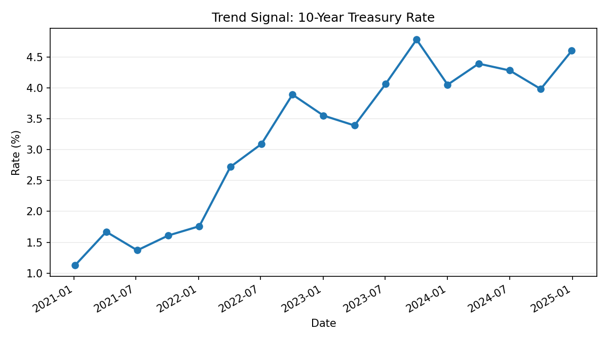

# Trend Signal: Interest Rates

## What Is Happening

The 10-year Treasury rate ended much higher than where it began. The path was not perfectly smooth, but the overall direction is clear: long-term interest rates moved up substantially from early 2021 through the end of 2024.

## Why It Matters

This matters because long-term interest rates influence the cost of borrowing across the economy. When these rates rise, mortgages, business loans, public financing, and investment decisions can all become more expensive or more cautious.

The signal is not just that rates changed. The important point is that the interest-rate environment shifted. A decision-maker should recognize that the later period reflects a very different set of conditions than the starting point.

## Key Observations

- The rate moved meaningfully higher over the period  
- The increase was not a straight line, but the broader direction remained upward  
- The later values suggest a higher-rate environment than earlier periods  

## What to Notice

- The shift is directional, not temporary  
- The change is meaningful, not minor  
- The environment has changed, even if the path was uneven  

## Takeaway

Long-term interest rates moved from a low-rate environment into a much higher one. The practical signal is that borrowing and planning conditions became more demanding, and decisions made under earlier assumptions may no longer hold.

## Why focus on interest rates?

I started with interest rates because they are widely followed and frequently discussed.

Most people are aware that rates matter, but the way they are presented often lacks context. We hear that rates are rising or falling, but not always how to interpret that change or what it implies for decisions.

This example is meant to show how even a familiar signal becomes more useful when we focus on how it is changing over time and what that change actually means.